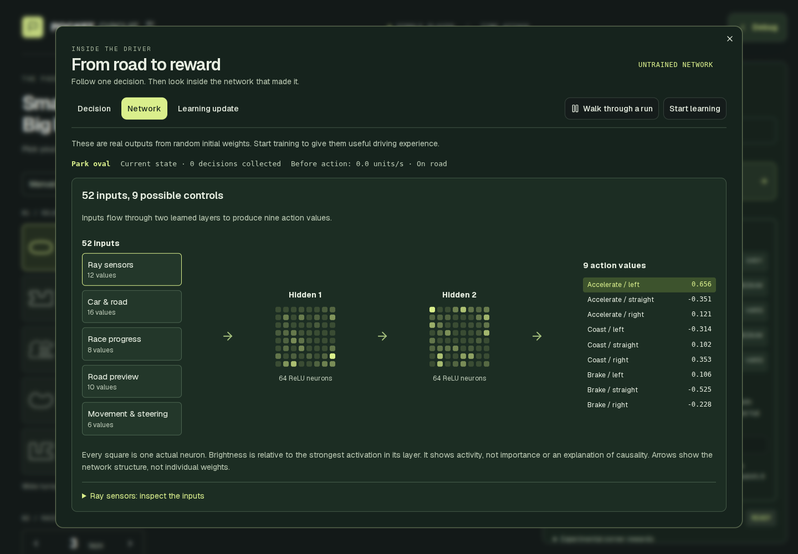

# Pocket Circuit

A small top-down racing game built with Three.js. Drive it yourself, or watch a neural network learn to race. Five circuits, 1–10 laps, all in your browser.


## Run the simulation

Use Node.js 22.13 or newer and a browser with WebGL enabled.

```sh
npm install
npm run dev
```

Open the local URL printed in your terminal. Choose a circuit and lap count.

- Drive with the arrow keys. Escape pauses; R puts the car back on the track.
- Choose **Train AI → Start training** to teach the car. The default trains one model across Park Oval, Pine Bend and Desert Switchback.
- Choose **Fastest** to collect attempts faster, then **Run best model** to watch it drive in real time. **Pause all** pauses learning and playback.

Training runs locally with TensorFlow.js on the CPU in a browser worker. No Python server or API key needed. Saved model weights stay in your browser; refreshing ends the live training session.

## How the AI learns

By default, the car first learns from 12,000 examples supplied by a track-following instructor. Then it uses **Double DQN**, a reinforcement learning algorithm, to improve through driving attempts. Turn off **Guided warm-up before RL** to learn from rewards alone.

Every 0.1 simulated seconds, the network picks one of nine actions: accelerate, coast or brake, combined with left, straight or right steering. It stores what happened and learns from batches of past experience, with occasional random actions to explore. One network chooses the next action; a delayed copy estimates its future reward. Instructor examples remain part of training to help prevent forgetting. During playback, the network drives on its own.

The network has two hidden layers:

```text
52 inputs → 64 neurons, ReLU → 64 neurons, ReLU → 9 action values
```

Each output estimates the future reward of an action. Training uses Adam and Huber loss, plus cross-entropy loss for instructor examples.

The input features describe:

- 12 ray distances to road edges.
- Speed, steering, pedals and turning motion.
- Road offset, heading, upcoming waypoints, road width and estimated safe corner speed.
- Lap/checkpoint progress, time, off-road duration and recent movement.

The default keeps four absolute-position inputs at zero. It still uses the circuit map for road shape and waypoints, so the car has more information than its rays alone.

## See how the AI learns

Open **Train AI → See how the AI learns** for a visual explanation connected to the real learner. Three views keep the explanation manageable:



- **Decision** shows a road close-up with the actual ray intersections, the nine action values, whether the action came from the network or random exploration, and the points actually earned by that step. Switch to the whole-circuit view for context. Before RL has trained, outputs are labelled as uncalibrated action scores.
- **Network** groups the 52 inputs and shows all 64 neurons in each hidden layer as compact activation grids, followed by the nine outputs. Click an input group and expand its details to inspect the normalized values. Brightness is relative within each layer. It shows activation, not feature importance or a causal explanation. Structural arrows avoid drawing thousands of overlapping connections.
- **Learning update** shows eight of the actual 32 replay experiences sampled for an optimizer update. Select one to compare its predicted action value before the update, its learning target, and its value afterward. Expanded details separate the reward-value loss from the weighted demonstration loss. These samples can come from earlier decisions and different training circuits. The displayed batch stays still while learning continues; use **Refresh sampled update** to inspect a newer one.

[View the decision walkthrough](docs/screenshots/learning-decision.png).

**Walk through a run** pauses learning and playback, copies the current learner into an isolated environment on the viewed circuit, and freezes its weights. Choose the finish line or a position one-third/two-thirds around the circuit. Select a pedal/steering action, or accept the network's choice, then advance by 0.1 simulated seconds. The copy uses the real physics and reward rules but never contributes experiences or gradient updates. A manual choice is labelled separately from a network choice. **Resume learning** discards the copy and continues the original session. Closing the walkthrough leaves the session paused until resumed.

If a saved best model exists, the Network view can compare its action values with the learner's using exactly the same inputs. This is a comparison of preferences in one situation, not a full-race benchmark. Use the existing evaluation and playback controls to compare driving success.

Live diagnostics are opt-in and sampled at most four times per second. Opening the panel does not consume the training random-number stream or alter gradient results. During guided warm-up the panel explains instructor learning; replay-update data appears only after actual RL updates. The views use real readings rather than illustrative, fabricated training numbers.

Browser and worker checks for this feature, after building and starting the preview:

```sh
node scripts/insights-browser.mjs
node scripts/insights-worker.mjs
```

## How scoring works

An episode is one driving attempt. Its score adds up rewards and penalties. With the default **Local inputs** preset:

| Event | Points |
| --- | ---: |
| New forward progress on the road | Up to +750 per lap |
| Passing checkpoints in order | +1,000 total per lap |
| Completing a lap | +1,000 |
| Driving backward | −750 × fraction of a lap traveled backward |
| Time off-road | −50 per second |
| Elapsed time | −1 per second |
| Failure or timeout | −100 |

Retracing ground earns no extra progress reward. Leaving the track too long, getting stuck or exceeding the time limit ends the attempt. Other reward presets change these rules.

Evaluation tests five fixed starting poses per circuit without random exploration. Best-model selection favors completing all requested laps, then average score. A lower training loss alone does not mean better driving.

For experiments and benchmark results, see the [learning investigation](docs/plateau-investigation.md).
