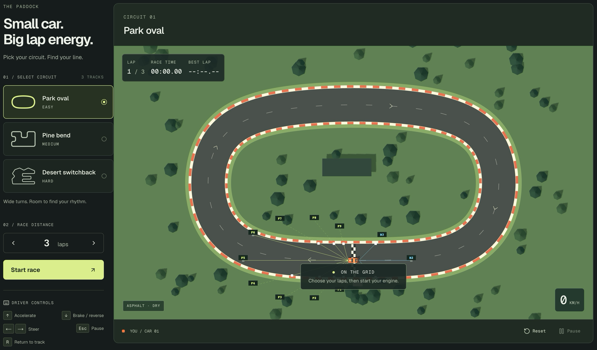

# Pocket Circuit

A small top-down racing game built with Three.js. Drive it yourself, or watch a neural network learn to race. Five circuits, 1–10 laps, all in your browser.



## Run the simulation

Use Node.js 22.13 or newer and a browser with WebGL enabled.

```sh
npm install
npm run dev
```

Open the local URL printed in your terminal. Choose a circuit and lap count.

- Drive with the arrow keys. Escape pauses; R puts the car back on the track.
- Choose **Train AI → Start training** to teach the car. The default trains one model across Park Oval, Pine Bend and Desert Switchback.
- Choose **Fastest** to collect attempts faster, then **Run best model** to watch it drive in real time. **Pause all** pauses learning and playback.

Training runs locally with TensorFlow.js on the CPU in a browser worker. No Python server or API key needed. Saved model weights stay in your browser; refreshing ends the live training session.

## How the AI learns

By default, the car first learns from 12,000 examples supplied by a track-following instructor. Then it uses **Double DQN**, a reinforcement learning algorithm, to improve through driving attempts. Turn off **Guided warm-up before RL** to learn from rewards alone.

Every 0.1 simulated seconds, the network picks one of nine actions: accelerate, coast or brake, combined with left, straight or right steering. It stores what happened and learns from batches of past experience, with occasional random actions to explore. One network chooses the next action; a delayed copy estimates its future reward. Instructor examples remain part of training to help prevent forgetting. During playback, the network drives on its own.

The network has two hidden layers:

```text
52 inputs → 64 neurons, ReLU → 64 neurons, ReLU → 9 action values
```

Each output estimates the future reward of an action. Training uses Adam and Huber loss, plus cross-entropy loss for instructor examples.

The input features describe:

- 12 ray distances to road edges.
- Speed, steering, pedals and turning motion.
- Road offset, heading, upcoming waypoints, road width and estimated safe corner speed.
- Lap/checkpoint progress, time, off-road duration and recent movement.

The default keeps four absolute-position inputs at zero. It still uses the circuit map for road shape and waypoints, so the car has more information than its rays alone.

## How scoring works

An episode is one driving attempt. Its score adds up rewards and penalties. With the default **Local inputs** preset:

| Event | Points |
| --- | ---: |
| New forward progress on the road | Up to +750 per lap |
| Passing checkpoints in order | +1,000 total per lap |
| Completing a lap | +1,000 |
| Driving backward | −750 × fraction of a lap traveled backward |
| Time off-road | −50 per second |
| Elapsed time | −1 per second |
| Failure or timeout | −100 |

Retracing ground earns no extra progress reward. Leaving the track too long, getting stuck or exceeding the time limit ends the attempt. Other reward presets change these rules.

Evaluation tests five fixed starting poses per circuit without random exploration. Best-model selection favors completing all requested laps, then average score. A lower training loss alone does not mean better driving.

For experiments and benchmark results, see the [learning investigation](docs/plateau-investigation.md).
