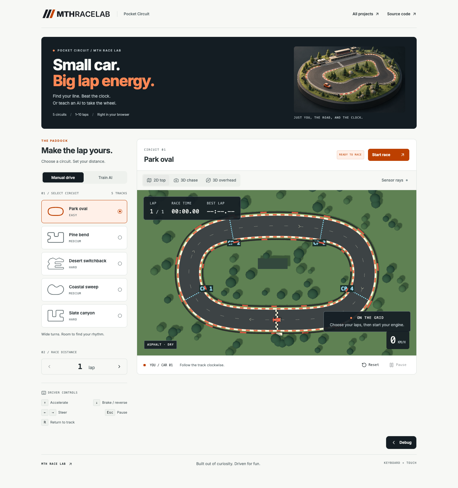

# Pocket Circuit

Drive a small 2D racing game in your browser. You can also train an AI driver and watch it learn.

[**Play Pocket Circuit**](https://circuit.mthracelab.com/)



*Actual game screenshot. The cover artwork is an illustration.*

## Start here

1. Choose a circuit and the number of laps.
2. Select manual driving and start the race.
3. Use the arrow keys to steer, accelerate, and brake. On a phone, use the touch controls.

Press **Escape** to pause. Press **R** to return to the last checkpoint.

To try the AI driver, select its training mode and start training. Models stay in your browser. Training results describe this game; they do not establish real driving ability.

## Run locally

Use Node.js 22.13 or later and npm.

```sh
npm ci
npm run dev
```

See the [technical guide](TECHNICAL_GUIDE.md) for AI training, model storage, circuit generation, build checks, and deployment. The [artwork notes](docs/project-artwork.md) record the cover's source.
